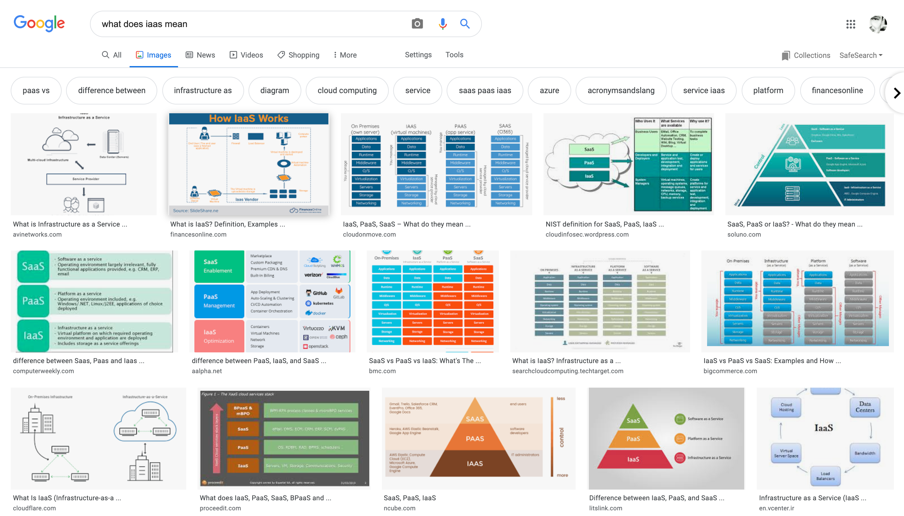
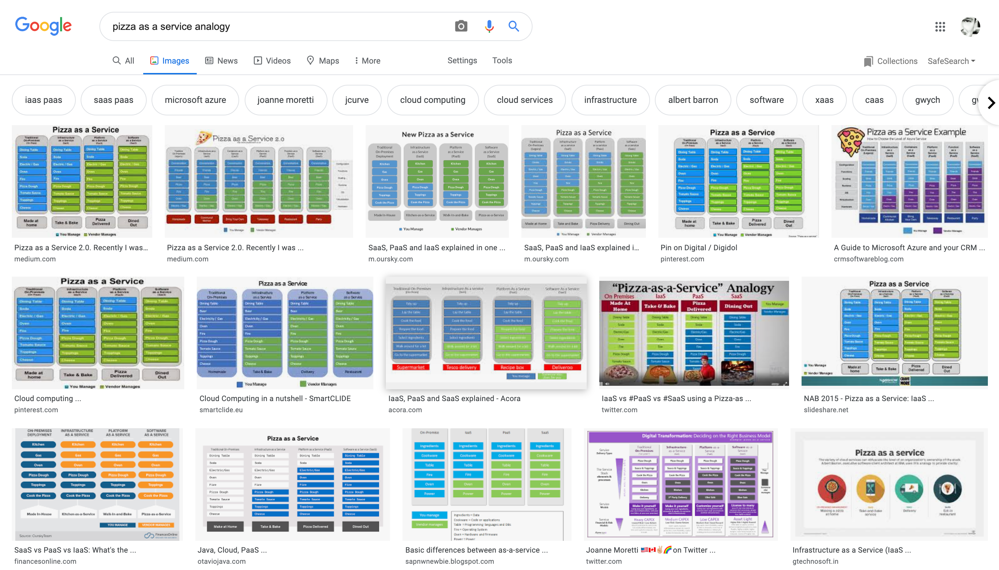

# UNIT ==========
{:
  display_name="What does Iaas mean?"
}

# COMPONENT ==========
{:
  type="html"
  display_name="Find the meaning, do your research!"
}

Infrastructure as a Service (IaaS) is an instant computing infrastructure provisioned and managed over the internet. It's one of the three basic types of cloud services, along with Platform as a Service (PaaS) and Software as a Service (SaaS). 

Comparisons, analogies, visualizations, and more can be found, so there is a solution to understand the cloud computing models for every need.

Just do some research on your own to find a different explanation or visualization.

If your search query results on *what does iaas mean* are too dry for your taste, you can spice up your learning experience with an excellent analogy around "Pizza as a Service". This analogy explains the cloud computing models based on how you usually get to your Pizza experience.

Search *pizza as a service analogy* and enjoy ;)

