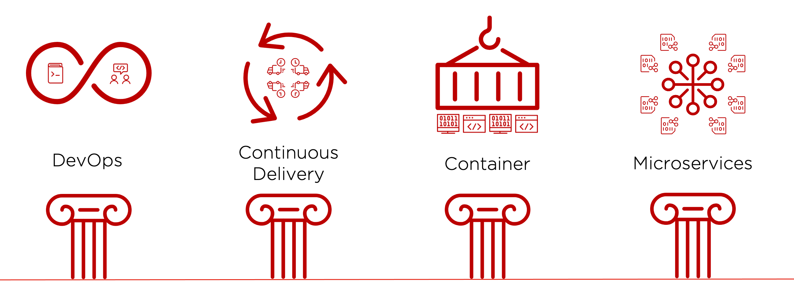
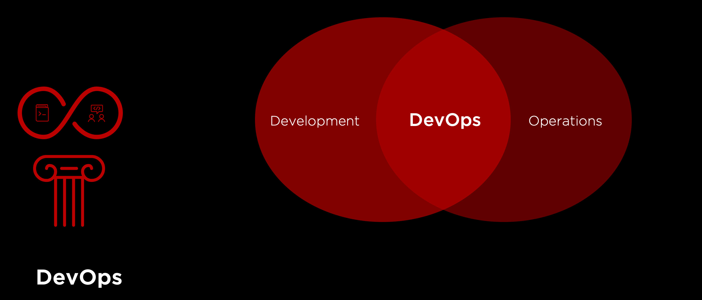
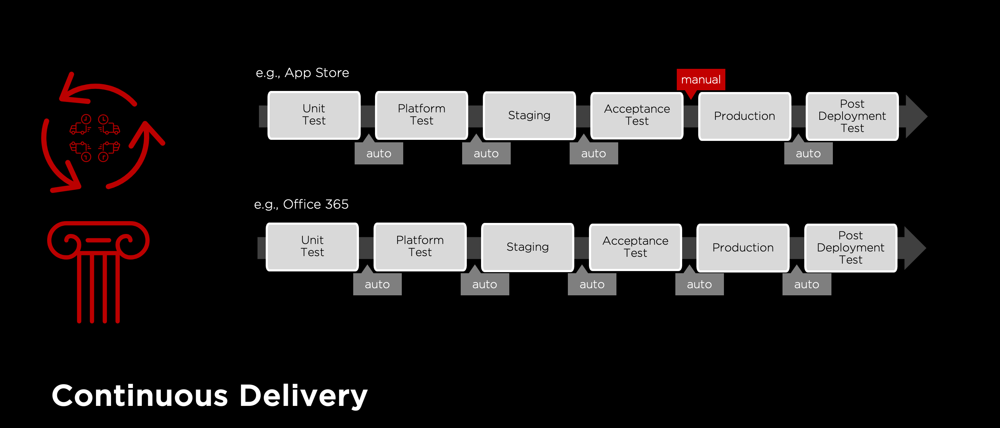
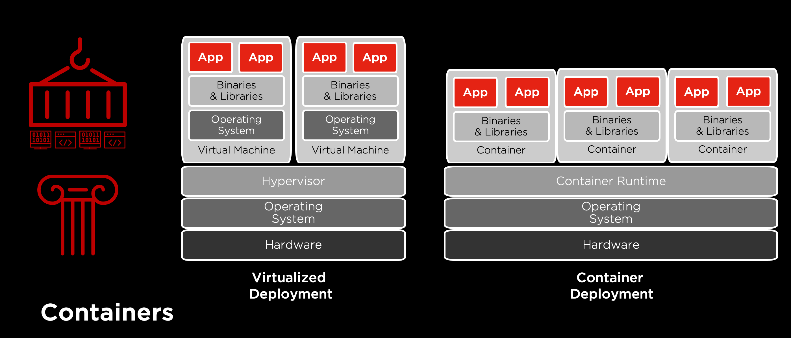
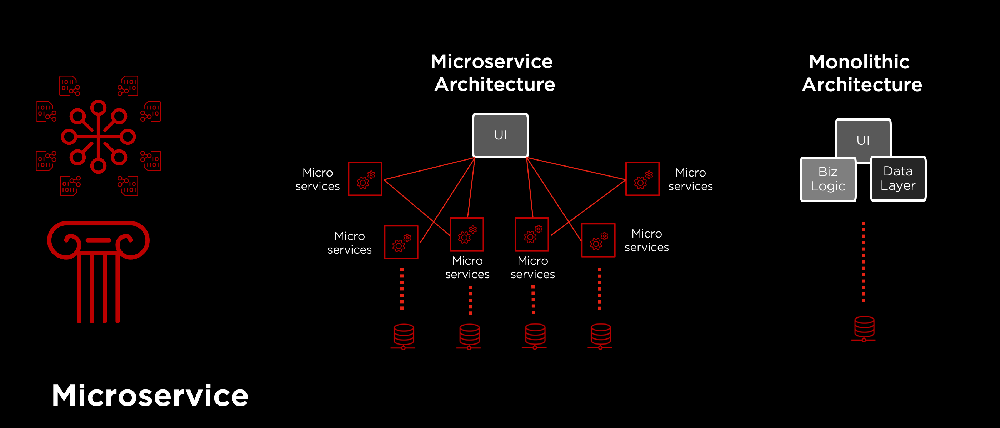

# UNIT ==========
{:
  display_name="Pillars of Cloud Native"
}

# COMPONENT ==========
{:
  type="html"
  display_name="The Four Pillars"
}

#### A Short Cloud Native Definition:
*software solutions designed for highly automated, container-based, cloud platforms* 

**DevOps** is an artificial word from the terms development and IT operations, which is supposed to improve the quality of the software, the speed of development and delivery, as well as the cooperation of the teams involved.

**Continuous Delivery** refers to a collection of techniques, processes and tools that improve the software delivery process. For an introduction, it is often recommended to implement the DevOps approach.

**Containers** refer to virtual machines that correspond to the entire application, including their configuration and dependencies. In contrast to a "real" virtual machine, a container does not contain its own operating system (application virtualization).

**Microservice** is an encapsulated, autonomously scalable (sub-)function of a larger, distributed software-solution that is independently developed and operated.