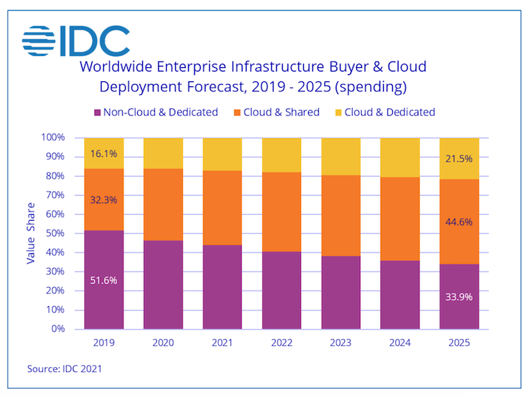

# UNIT ==========
{:
  display_name="Market View"
}

# COMPONENT ==========
{:
  type="html"
  display_name="World Wide Infrastructure Spendings"
}

The IDC figures show clearly that the infrastructure game is changing. Even though there are still markets out there where cloud adoption is low and slow, there is a clear trend that public cloud will be a significant part of IT infrastructure. 

By 2025 the traditional on-premises part (non-cloud &amp; dedicated) will be down from more than half of the market to one-third of the market, the public cloud (cloud &amp; shared) part will be up from 32% to 44%, and the private cloud (cloud &amp; dedicated) share will grow from 16% to 21%. 

Hence, Exoscal IaaS is part of the infrastructure mix from now on, especially for cloud-native workloads and all types of modern apps. 

